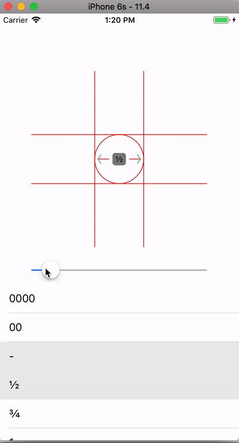
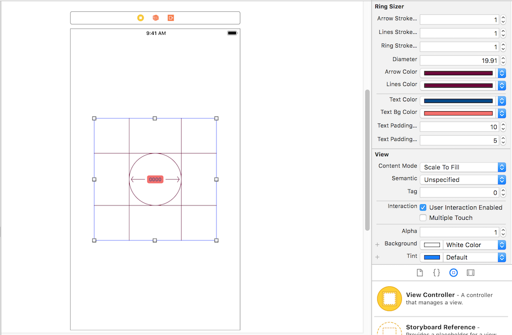

# Ring-Sizer-Swift

[](https://github.com/zelin/Ring-Sizer-Swift)
[](https://github.com/zelin/Ring-Sizer-Swift)
[](https://github.com/zelin/Ring-Sizer-Swift)
[](http://neberox.tk/donate/?amount=2&currency=USD)



## Installation

The easiest way to add the library to your project is by adding it via pods

```ruby
target 'MyApp' do
  pod 'RingSizerSwift', '~> 0.1'
end
```

## Usage

### Integration

Add it via code programmatically

```swift 
        
let ringsizer : RingSizer = RingSizer.init(frame: CGRect.init(x: 0, y: 0, width: 200, height: 200))
ringsizer.center = self.view.center;
self.view.addSubview(ringsizer)

```

Or via Storyboard



### Options available

```swift  

// Default sizes added in library
let ringSizes : NSMutableArray = self.ringSizer.getRingSizes()

self.ringSizer.textFont = UIFont.systemFont(ofSize: 12)
self.ringSizer.textColor = UIColor.black;
self.ringSizer.textBgColor = UIColor.gray

self.ringSizer.arrowColor = UIColor.gray;
self.ringSizer.arrowStrokeWidth = 1.0

self.ringSizer.linesColor = UIColor.gray;
self.ringSizer.linesStrokeWidth = 1.0
        
self.ringSizer.linesColor = UIColor.red
self.ringSizer.ringStrokeWidth = 1.0

// 9.91 millimeter size 0000
self.ringSizer.setSize(diameter: 9.91, text: "0000");

```
## Attributes

| Name | Description | Default
| ------ | ------ | ------ |
| arrowStrokeWidth(optional) | Stroke width of the arrows | 1.0 |
| linesStrokeWidth(optional) | Stroke width of the lines of the grid | 1.0 |
| ringStrokeWidth(optional) | Stroke width of the circle upon which ring will be placed | 2.0 |
| diameter(optional) | Diameter of the ring. Should be in mm | 9.91 |
| arrowColor(optional) | Color of the arrows drawn. To remove color set UIColor.clear | UIColor.gray |
| linesColor(optional) | Color of the grid lines drawn. To remove color set UIColor.clear | UIColor.gray |
| textColor(optional) | Color of the size written in center of ring sizer | UIColor.black |
| textBgColor(optional) | Color of the background of textLabel | UIColor.gray |
| textFont(optional) | Text font size | System font 12.0 |
| textPaddingWidth(optional) | left and right text Padding to add in textLabel | 10.0 |
| textPaddingHeight(optional) | top and bottom text Padding to add in textLabel | 5.0 |

## Author

Muhammad Umar, https://github.com/zelin

## License

Ring-Sizer-Swift is available under the MIT license. See the LICENSE file for more info.
